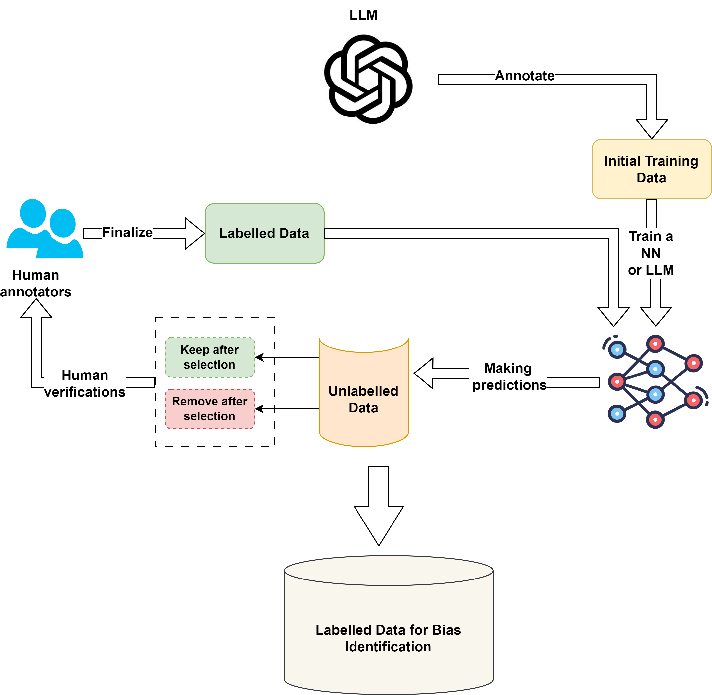

# FAIR Principles for Data Management

Ensuring data is **Findable, Accessible, Interoperable, and Reusable** is essential for effective data management, especially in the age of big data and AI. This repository shows our approach to adopting the FAIR principles, with an emphasis on specific data formats and methodologies for training classifiers.

## Table of Contents
- [Introduction](#introduction)
- [Binary and Multi-label Classification](#binary-and-multi-label-classification)
- [CONLL BIO FORMAT](#conll-bio-format)
- [Debiasing Training Data](#debiasing-training-data)
- [Active Learning and Labeling](#active-learning-and-labeling)

## Introduction
The FAIR principles guide our data management strategy, ensuring our datasets are:
- **Findable**: Easily located and identified.
- **Accessible**: Available for retrieval without unnecessary barriers.
- **Interoperable**: Compatible with other data systems and platforms.
- **Reusable**: Ready for future applications and re-analysis.

## Binary and Multi-label Classification
To train the UnBIAS classifier, data should be labeled either as "biased" or "unbiased". Multi-label classifications are also supported.

**Example**:
```
Sentence: "Women can't drive well."
Label: "biased"
```

## CONLL BIO FORMAT
For training named entities, data should be in the CONLL BIO format. 

**Example**:
```
Sentence: "He made a discriminatory remark."
BIO Format: "He O made O a O discriminatory B remark I . O"
```

## Debiasing Training Data
For the debiaser in UnBIAS, the dataset should contain both the original "biased_text" and its "debiased_version".

**Example**:
```
Biased Text: "Men are better leaders."
Debiased Version: "Leadership ability isn't gender-specific."
```

## Active Learning and Labeling
Active learning is a crucial component of our data preparation methodology for UnBIAS. Here's our approach:

1. **Iterative Labeling**: Begin by labeling a small subset of the data.
2. **Model Training**: Train a preliminary model using this subset.
3. **Uncertainty Sampling**: The model pinpoints data points of uncertainty.
4. **Human Intervention**: Experts label these uncertain points.
5. **Model Refinement**: The model is retrained with the new labeled data.




## Running the Unbias Package

The Unbias package allows you to easily process a batch of sentences to detect and rectify biases. Here's how you can do it:


```
from UnBIAS import run_pipeline_on_texts

# Define your test sentences
test_sentences = [
    "Women are just too emotional to be leaders.",
    "All young people are lazy.",
    "Men are naturally better at sports."
]

# Use the function
results = run_pipeline_on_texts(test_sentences)
result_df.head()
result_df.to_csv('UnBIAS-results.csv')
```

---

Contributors are welcome to aid in the enhancement of our documentation and methodologies.
