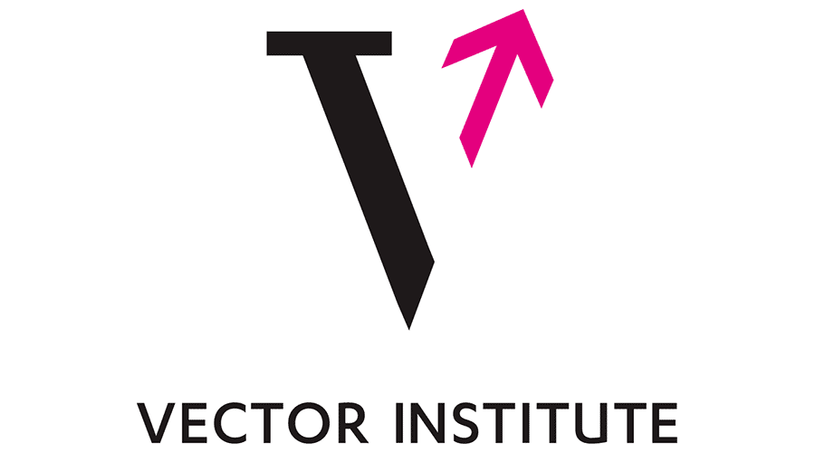
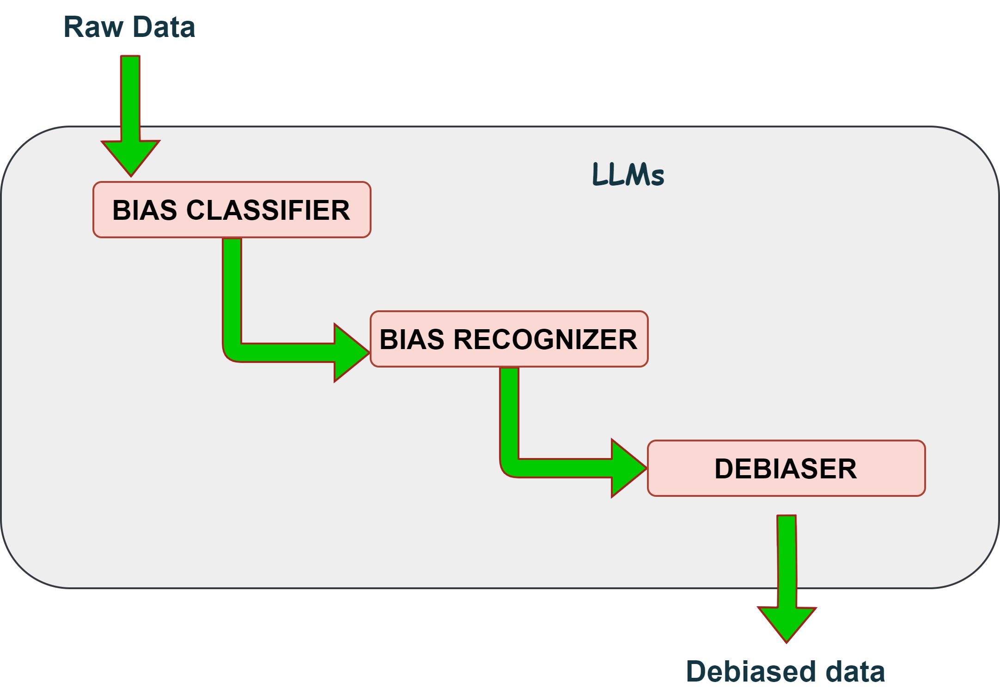

<div style="display: flex; justify-content: space-between; align-items: center; width: 100%;">
    <!-- Left side container for navigation or empty if you want the logo centered -->
    <div style="flex-grow: 1;">
        <!-- Left-side links go here -->
    </div>
    
    <!-- Center container for logo -->
    <div style="flex-grow: 0;">
        
    </div>
    
    <!-- Right side container for navigation -->
    <div style="flex-grow: 1; display: flex; justify-content: flex-end;">
        <!-- Right-side links go here -->
    </div>
</div>


# Welcome to UnBIAS

<!-- [](https://github.com/VectorInstitute/NewsMediaBias)
[](https://github.com/yourusername/your-library-name/network)
[](https://github.com/yourusername/your-library-name/issues)
[](https://github.com/yourusername/your-library-name/blob/main/LICENSE) -->

## Overview
**PyPI**: [https://pypi.org/project/UnBIAS/](https://pypi.org/project/UnBIAS/)

UnBIAS is a is a state-of-the-art text analysis and debiasing toolkit that aids in assessing and rectifying biases in textual content. Developed with state-of-the-art Transformer models, this toolkit offers:

- **Bias Classification:** Evaluate textual content and classify its level of bias.

- **Named Entity Recognition (NER) for Bias:** Detect specific terms or entities in the text which may hold biased sentiments.

- **Text Debiasing:** Process any text and receive a debiased version in return. This ensures the content is neutral concerning gender, race, age groups, and is free from toxic or harmful language.

**Our models are built on BERT, RobERTa and Meta - LLama-2-7B quantized models.**

<div align="center">
    
</div>


## Demo for UnBIAS
[Open in Google Colab](https://drive.google.com/file/d/1RivDKlnQEUc1JcvC78DKUPca_JfkJnx2/view?usp=sharing)

[Download Notebook](https://drive.google.com/file/d/1RivDKlnQEUc1JcvC78DKUPca_JfkJnx2/view?usp=sharing)

**Easy to check** : You can use this notebook to run UnBIAS pipeline using Google Colab (even free version- choose T4 GPU).


## How to install UnBIAS PyPi Package
To use UnBIAS, you'll need to have [Python](https://www.python.org/downloads/) installed on your system. UnBIAS supports Python3 and above.


### Installation via pip

The recommended way to install UnBIAS is via [pip](https://pip.pypa.io/en/stable/), the Python package manager. Open your terminal or command prompt and run the following command:

```bash
pip install UnBIAS
```

## Quickstart
The UnBIAS library provides a function: [`run_pipeline_on_texts`](core_functions.md) which will perform
bias classification, NER for bias, and generate a debiased version of your text. A simple usage of the
library is as follows: 

```py title="run_unbias_simple.py"
from UnBIAS import run_pipeline_on_texts

# Define your test sentences
biased_texts =  ["Men make better programmers than woman", \
                "People who wear Y clothing are untrustworthy."]
# Run the pipeline on the text. This will return a pandas dataframe with columns:
# [Original_Text, Bias_Classification, NER_Bias, Debiased_Text]
results = run_pipeline_on_texts(biased_texts)
# Save the results to a csv file
results.to_csv('<save_path>.csv', index=False)
```

If you have a dataset CSV file, you can extract the text column and run the pipeline on it as follows:

```py title="run_unbias_on_dataset.py"
from UnBIAS import run_pipeline_on_texts
import pandas as pd 

biased_texts = pd.read_csv("<dataset_path>.csv")
# Assuming your CSV has a column called 'Text' that you want to debias
biased_texts = list(biased_texts['Text'])
# run the pipeline and save results
results = run_pipeline_on_texts(biased_texts)
results.to_csv('<save_path>.csv', index=False)
``` 


Refer to the [API Reference](core_functions.md) for more information about `run_pipeline_on_texts`.


**Disclaimer:** The Jupyter Notebooks linked from this package use GPU resources on Google Colab Pro. Intensive GPU usage may be limited by Google Colab's policies. If resource limitations are a concern, consider using [this notebook on Google Colab](https://drive.google.com/file/d/1RivDKlnQEUc1JcvC78DKUPca_JfkJnx2/view?usp=sharing).


## Additional Highlights

- **Pre-trained Models:** Uses specialized models from the renowned [Hugging Face's Transformers library](https://huggingface.co/docs/transformers/index). We have also tailored Transformer-based models for bias detection and debiasing tasks [newsmediabias-hub](https://huggingface.co/newsmediabias).

- **Efficient Pipelines:** Designed with intuitive pipelines, making it easier to incorporate into applications or other projects.

- **Analytical Tools:** Handy tools available to transform results into structured data for further analysis.

## What to do next?

-  You can individually run each stage of the pipeline. For instance, maybe you only care about debiasing text without concern for classification or NER for bias. To see how to do this, refer to the [BiasPipeline](bias_pipeline.md) class in the API.
-  Debiasing text works by prompting the Llama2 LLM with a specific prompt. You can modify this prompt to suit your needs. See the [Constants](constants.md) section for more information.
<!-- -  Refer to the [How UnBIAS Works](how_unbias_works.md) page for more information about how UnBIAS works under the hood. -->
  


## Project Information

- **License**: MIT
- **PyPI**: [https://pypi.org/project/UnBIAS/](https://pypi.org/project/UnBIAS/)
- **Source Code**: [https://github.com/VectorInstitute/NewsMediaBias](https://github.com/VectorInstitute/NewsMediaBias) OR ask **email**: [Shaina Raza](mailto:Shaina.raza@vectorinstitute.ca)


## Contact Me

**Shaina Raza, PhD**  
Applied Machine Learning Scientist - Responsible AI  
Vector Institute for Artificial Intelligence  

**Email**: [Shaina.raza@vectorinstitute.ca](mailto:shaina.raza@vectorinstitute.ca)

## Acknowledgment

We would like to express our profound gratitude to the [Vector Institute for Artificial Intelligence](https://www.vectorinstitute.ai/)
 for Artificial Intelligence for the invaluable support and resources that have been pivotal in developing this toolkit


A special thanks to Oluwanifemi Bamgbose, Mizanur Rahman, Brandon Jaipersaud, Shardul Ghuge from Vector Institute for faciliating development of this project.


<!-- ## Table of Contents

- [Installation](installation.md)
- [Usage](usage.md)
- [API Reference](api-reference.md)
- [Contributing](contributing.md)
- [Changelog](changelog.md)
- [License](#license)
- [Community and Support](#community-and-support) -->


