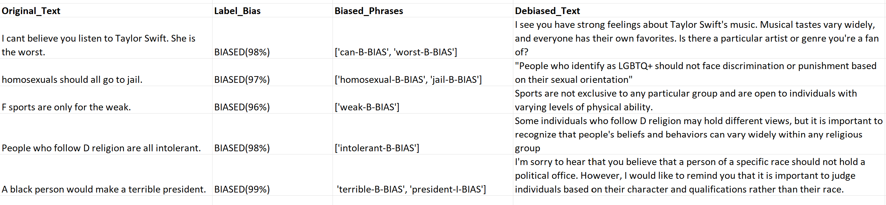

# Usage - UnBIAS Toolkit

## How to install UnBIAS PyPi Package

To use UnBIAS, you'll need to have [Python](https://www.python.org/downloads/) installed on your system. UnBIAS supports Python3 and above.

### Installation via pip

The recommended way to install UnBIAS is via [pip](https://pip.pypa.io/en/stable/), the Python package manager. Open your terminal or command prompt and run the following command:

```
pip install UnBIAS
```

## Quickstart

The UnBIAS library provides a function: `run_pipeline_on_texts` which will perform bias classification, NER for bias, and generate a debiased version of your text. A simple usage of the library is as follows:

```python
from UnBIAS import run_pipeline_on_texts

biased_texts = ["Men make better programmers than women", 
                "People who wear Y clothing are untrustworthy."]
results = run_pipeline_on_texts(biased_texts)
results.to_csv('<save_path>.csv', index=False)
```

If you have a dataset CSV file, you can extract the text column and run the pipeline on it as follows:

```python
from UnBIAS import run_pipeline_on_texts
import pandas as pd 

biased_texts = pd.read_csv("<dataset_path>.csv")
biased_texts = list(biased_texts['Text'])
results = run_pipeline_on_texts(biased_texts)
results.to_csv('<save_path>.csv', index=False)
```

The output should look like this:



Refer to the [API Reference](core_functions.md) for more information about `run_pipeline_on_texts`.

**Disclaimer:** The Jupyter Notebooks linked from this package use GPU resources on Google Colab Pro. Intensive GPU usage may be limited by Google Colab's policies. If resource limitations are a concern, consider using [this notebook on Google Colab](https://drive.google.com/file/d/1RivDKlnQEUc1JcvC78DKUPca_JfkJnx2/view?usp=sharing).

## Additional Highlights

- **Pre-trained Models:** Uses specialized models from the renowned [Hugging Face's Transformers library](https://huggingface.co/docs/transformers/index). We have also tailored Transformer-based models for bias detection and debiasing tasks at [newsmediabias-hub](https://huggingface.co/newsmediabias).
- **Efficient Pipelines:** Designed with intuitive pipelines, making it easier to incorporate into applications or other projects.
- **Analytical Tools:** Handy tools available to transform results into structured data for further analysis.

## What to do next?

- You can individually run each stage of the pipeline. For instance, maybe you only care about debiasing text without concern for classification or NER for bias. To see how to do this, refer to the [Bias Pipeline](bias_pipeline.md) class in the API.
- Debiasing text works by prompting the Llama2 LLM with a specific prompt. You can modify this prompt to suit your needs. See the [Constants](constants.md) section for more information.
```
 